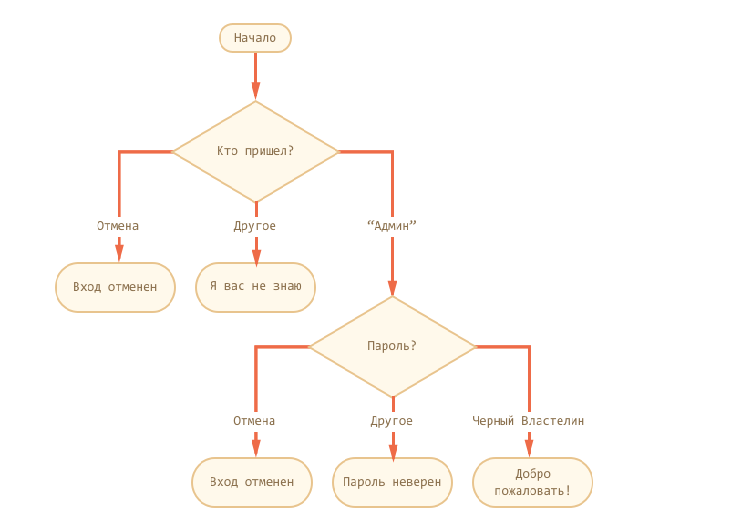

# Домашняя работа

# Читаем информационные ресурсы:
 * https://learn.javascript.ru/switch
 * https://learn.javascript.ru/operators
 * https://developer.mozilla.org/ru/docs/Web/JavaScript/Reference/Operators/typeof
 * http://learn.javascript.ru/external-script
 * https://developer.mozilla.org/ru/docs/Web/JavaScript/Reference/Statements/if...else
 * https://developer.mozilla.org/ru/docs/Web/JavaScript/Reference/Statements/for
 * https://developer.mozilla.org/ru/docs/Web/JavaScript/Reference/Statements/do...while

# Практика

 1. Заставить пользователя ввести с клавиатуры число.

 2. Посчитать факториал n!, где n - ввести с клавиатуры.
 
 3. Написать скрипт возведения числа A в степень B. 

 4. Реализовать скрипт который получает номер n, и возвращает число Фибоначчи по этому номеру.

  
# Лекция
 1. Реализовать скрипт согласно схеме:
     

 2. 
   2.1 Ораганизовать перебор чисел от 1 до 150. 
   2.2 Посчитать сумму чётных чисел.
 

